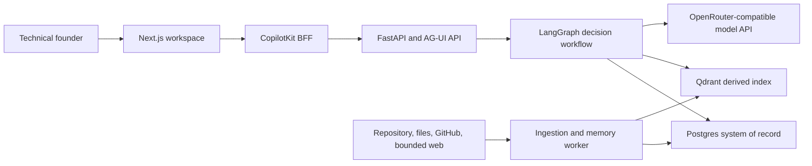

# System Context

AI CTO Cockpit is a persistent decision workspace for technical founders. It collects
authorized project evidence, frames architecture decisions, produces cited option
assessments, records explicit outcomes, and carries approved facts into later decisions.

## Runtime Context

## Trust Boundaries

1. **Browser to server:** the browser is untrusted. Workspace scope, authorization,
   connector capability, and provider credentials are derived on the server.
2. **Server to model provider:** selected evidence may leave the machine. Local-data mode
   is local storage, not offline inference, and must disclose egress before activation.
3. **Sources to ingestion:** repository text, issues, pull requests, uploads, and web
   pages are untrusted data. Instructions inside them never gain tool or policy authority.
4. **Application to indexes:** Postgres owns canonical text and state. Qdrant is
   disposable, scoped, and rebuildable from approved Postgres revisions.
5. **Model to application:** model output is a proposal. Pydantic schemas validate its
   shape; deterministic application code enforces constraints, authorization, scoring,
   persistence, and allowed UI actions.

## Data Ownership

| Data | Authoritative store | Notes |
|---|---|---|
| Source metadata and immutable revisions | Postgres | Includes checksum, locator, access scope, and deletion state |
| Decision frames, runs, recommendations | Postgres | Runs retain prompt, model, retriever, schema, and evidence fingerprints |
| Outcome and memory events | Postgres | Append-only; projections may be rebuilt |
| Vector embeddings and search payloads | Qdrant | Must include server-derived `workspace_id` and canonical revision ID |
| Uploaded blobs | Local object directory in v1 | Referenced by checksum; deleted through a tracked job |
| Browser session overlay | Signed server session | Public-demo data expires after 24 hours |

## Deployment Profiles

### Public Demo

- Uses only the original synthetic corpus under `seed/sample-project/`.
- Provides a signed guest overlay with 24-hour expiry and a visible reset action.
- Rejects uploads and live connector configuration.
- Applies per-IP, per-session, concurrency, token, and daily-spend limits.

### Local Data

- Persists Postgres, Qdrant, and source blobs on the operator's machine or infrastructure.
- Enables allowlisted repository, file, read-only GitHub, and bounded web adapters.
- Uses an operator-supplied model-provider key held only by the backend.
- Displays the exact evidence classes eligible for external model inference.

## Execution Invariants

- Every persisted or indexed object has a server-derived `workspace_id`.
- Mutations require an idempotency key and expected revision.
- Only explicit user actions accept, edit, dismiss, supersede, confirm, or delete durable
  knowledge.
- Hard constraints use typed evaluators; the model cannot override their result.
- A recommendation without sufficient, non-conflicting evidence must abstain.
- Citation text is read from the immutable source revision, not reconstructed by a model.
- React renders a versioned catalog of controlled components. Unknown component and action
  kinds fail closed; arbitrary HTML and JavaScript are never rendered.
- Streamed events are persisted before acknowledgement and can be replayed after a client
  reconnects.

## Failure Behavior

- Model timeout or malformed output produces a retryable run failure without committing a
  recommendation.
- Qdrant unavailability degrades to scoped Postgres full-text search and marks the run.
- A stale expected revision returns `409` and preserves both the current record and the
  caller's unsaved draft.
- Citation validation failure permits one bounded repair attempt, then causes abstention.
- Worker leases expire safely; idempotent jobs resume without duplicating source revisions
  or memory events.

